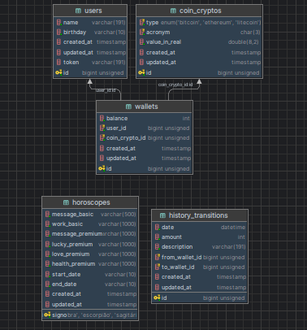

# Laravel-API-traineer
 Repositório de aprendizado para criação de WS-API Laravel

## Arquivos utilizados para atividade
#### ATV-01
- [HoroscopesController](app/Http/Controllers/API/HoroscopesController.php)
- [signo view](resources/views/signo.blade.php)
- [horoscopo view](resources/views/horoscopos.blade.php)
- [API Consumer in Python](python/client-python.py)

#### ATV-02
- [WalletController](app/Http/Controllers/API/WalletController.php)

#### ATV-03
- [Cambio view](resources/views/cambio.blade.php)

#### Diagrama do Banco de Dados

## Github
[WS-API Laravel](https://github.com/Kevin-Ponciano/Laravel-API-Traineer)
